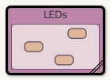

# Example Source Code for Chapter 03

```
.
├── additional-examples
│   ├── fractions
│   ├── gcd.txt
│   └── scopes
├── book-projects
│   ├── clock-display
│   ├── clock-display-leds
│   ├── mail-system
│   └── number-display
├── kara
└── readme.md
```
## For the Lab: clock-display-leds

[book-projects/clock-display-leds](book-projects/clock-display-leds)

**After opening the project, make sure all files are compiled. This may require opening the package LEDs (where all the LED logic is hidden) and click "Compile" again.


### Examples

Initialize and start the clock, then toggle to fast ticker:

    LedDisplay ld = new LedDisplay();
    ld.start();
    ld.toggleTicker();
    ld.setTickerSpeed(100);
    ld.stop();

Test the crucial timeTicks:

    ld.setTime(11,59);
    ld.timeTick();
    ld.setTime(23,59);
    ld.timeTick();

## UML Diagrams
can be found here: [https://home.htw-berlin.de/~kleinen/material/info1/clock_display_refactoring/led_display/](https://home.htw-berlin.de/~kleinen/material/info1/clock_display_refactoring/led_display/)
